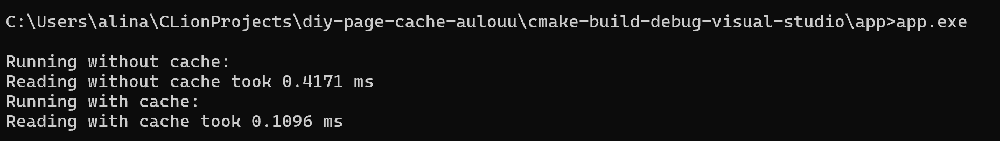

# Лабораторная работа #2 по ОС
## Отчёт

* Выполнила: Минкова Алина Андреевна, P3314
* Преподаватель: Рогачев Михаил Сергеевич
* Вариант: `Windows LFU`

## Задание

Для оптимизации работы с блочными устройствами в ОС существует кэш страниц с данными, которыми мы производим операции чтения и записи на диск. Такой кэш позволяет избежать высоких задержек при повторном доступе к данным, так как операция будет выполнена с данными в RAM, а не на диске (вспомним пирамиду памяти).

В данной лабораторной работе необходимо реализовать блочный кэш в пространстве пользователя в виде динамической библиотеки (dll или so). Политику вытеснения страниц и другие элементы задания необходимо получить у преподавателя.

При выполнении работы необходимо реализовать простой API для работы с файлами, предоставляющий пользователю следующие возможности:

1. Открытие файла по заданному пути файла, доступного для чтения. Процедура возвращает некоторый хэндл на файл. Пример:
   `int lab2_open(const char *path)`.
2. Закрытие файла по хэндлу. Пример:
   `int lab2_close(int fd)`.
3. Чтение данных из файла. Пример:
   `ssize_t lab2_read(int fd, void buf[.count], size_t count)`.
4. Запись данных в файл. Пример:
   `ssize_t lab2_write(int fd, const void buf[.count], size_t count)`.
5. Перестановка позиции указателя на данные файла. Достаточно поддержать только абсолютные координаты. Пример:
   `off_t lab2_lseek(int fd, off_t offset, int whence)`.
6. Синхронизация данных из кэша с диском. Пример:
   `int lab2_fsync(int fd)`.

Операции с диском разработанного блочного кеша должны производиться в обход page cache используемой ОС.

В рамках проверки работоспособности разработанного блочного кэша необходимо адаптировать указанную преподавателем программу-загрузчик из ЛР 1, добавив использование кэша. Запустите программу и убедитесь, что она корректно работает. Сравните производительность до и после.

### Ограничения
* Программа (комплекс программ) должна быть реализован на языке C или C++.
* Запрещено использовать высокоуровневые абстракции над системными вызовами. Необходимо использовать, в случае Unix, процедуры libc.

## Обзор кода

Я реализовала блочный кэш, который вытесняет блоки используя политику вытеснения LFU.
Также реализовала API для работы с файлами, который использует мой кэш в обход системного.

* В [CacheManager.h](Cache/CacheManager.h) определен класс CacheManager, который управляет кэшем блоков данных и содержит структуру Block, представляющую блок данных в кэше. 
* В [CacheManager.cpp](Cache/CacheManager.cpp) реализованы методы класса CacheManager, включая чтение и запись блоков данных, синхронизацию кэша с диском, а также методы для вытеснения наименее часто используемых блоков. 
* В [CacheAPI.h](Cache/CacheAPI.h) объявлены функции API для работы с файлами через кэш, такие как открытие, закрытие, чтение, запись, перемещение указателя и синхронизация данных. 
* В [CacheAPI.cpp](Cache/CacheAPI.cpp) реализованы эти функции API, используя CacheManager для управления кэшем. 
* В [app.cpp](app/app.cpp) реализована основная программа, которая демонстрирует работу с кэшем и без него, включая создание файлов, чтение данных с использованием кэша и без него, а также измерение времени выполнения операций.

## Сравнение нагрузчика с и без кэша

По результатам работы программы видно, что нагрузчик, использующий реализованный кэш, работает быстрее примерно в 4 раза.

## Вывод

В процессе выполнения лабораторной работы, я разобралась что такое кэш, зачем он нужен и как он работает.
Также я узнала про различные политики вытестнения и реализовала `Least frequently used` кэш на языке C++. 
Нагрузчик из первой лабораторной работы, который использует реализованный LFU кэш, работает быстрее.
Я собрала динамичную библиотеку (DLL), которую можно использовать при разработке других программ, не компилируя весь её код и использовать сразу несколькими процессами.
